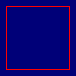

# Metehome

Affichage du soleil sur une matrice de 64 * 64 LEDs.
L'instalation est destinée à être placée sur un plafond pour servir à la fois d'éclarage et d'ambiance.

**TODO** Explication plus détaillée.

## Références

Wiki FabLab : https://fablab.ensimag.fr/index.php?title=Météhome

## Dépendances

Calcul de la position du soleil : https://github.com/Neon22/sun-angle  
Fade Candy : https://github.com/scanlime/fadecandy.git